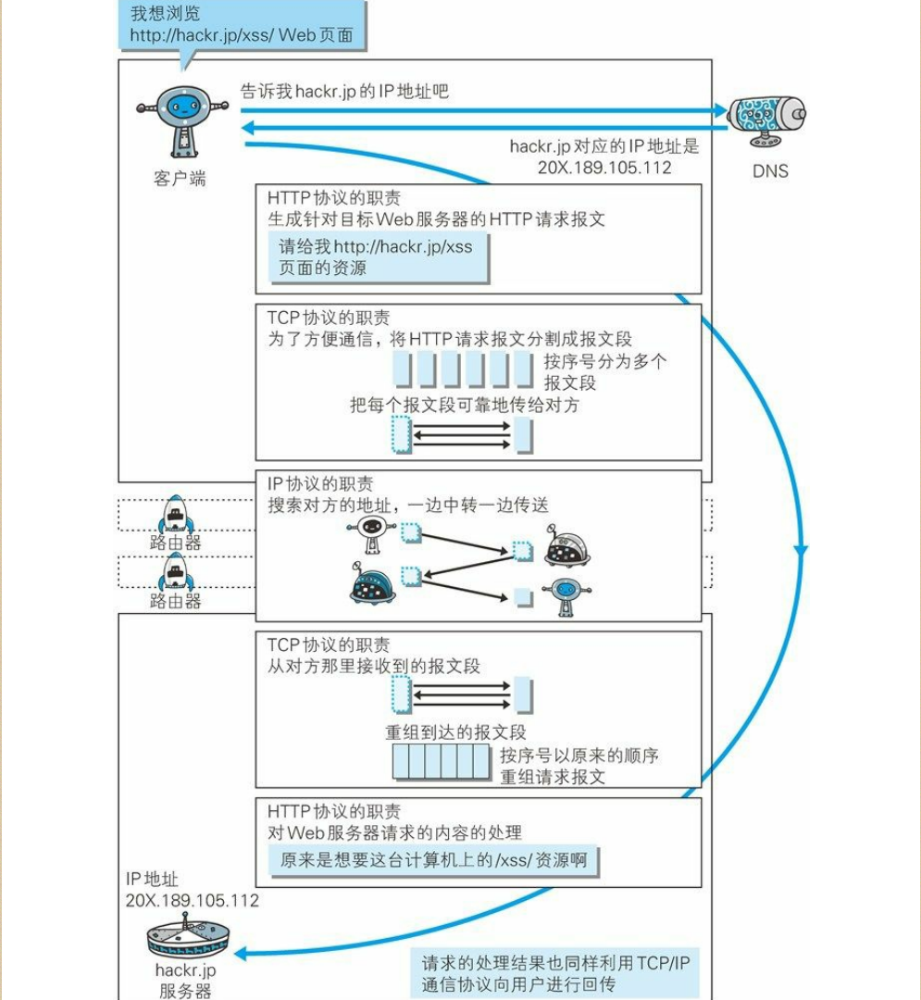

## Web网络基础

### 一、概念

**协议**：协议是指计算机通信网络中两台计算机之间进行通信所必须遵守的`规定`和`规则`。

**HTTP协议**：通常被翻译为“超文本传输协议”，是一种详细规定了浏览器和万维网服务器之间互相通信的规则，通过因特网传送万维网文档的数据传送协议`(互联网> 因特网> 万维网)`。它允许将超文本标记语言(html)文档从Web服务器传送到客户端的浏览器。HTTP1.1是如今浏览器主流的超文本传输协议版本。HTTP协议是一个`应用层`协议。

**TCP/IP协议族**：因特网所有的传输都是通过TCP/IP进行的，HTTP协议是TCP/IP协议族的一个子集。其它的协议有：IEEE,FDDI,ICMP,IP,PPPoE,DNS,UDP,TCP,FTP,HTTP,SNMP,FDDI等。TCP/IP协议族。TCP/IP协议族中最重要的一点就是`分层`。

**TCP/IP分层管理**：TCP/IP协议族按层次分为：`应用层`，`传输层`，`网络层`，`数据链路层`。

- 应用层：决定了向用户提供应用服务时通讯活动。FTP,DNS,HTTP都处于应用层。
- 传输层：为上层应用层提供网络连接中两台计算机的`数据传输`，TCP,UDP处于传输层。
- 网络层：该层决定了通过怎样的路径到达目标计算机，并将数据包传送给对方。
- 链路层：用来处理连接网络的硬件部分，包括操作系统，硬件的设备驱动，网卡等。

### 二、TCP/IP通信传输流

利用TCP/IP协议族进行网络通信时，会通过分层顺序与对方进行通信，`发送端从应用层往下，接收端反之`。

HTTP协议通信举例：

`应用层(HTTTP协议)`发送web页面http请求，`DNS协议`解析域名成IP地址  ==>（TLS/SSL协议，https才有这一层） ===>   `传输层(TCP协议)`将数据分割，加TCP首部 ==> `网络层(IP协议)`增加MAC地址，搜索目标地址传送 ==> `链路层`   ==> 服务端正好相反过程。

《图解HTTP》中TCP/IP通信传输截图如下：

### 三、与HTTP关系密切的协议

- DNS协议，位于应用层，提供域名和IP地址之间的解析服务

- TCP协议，位于传输层，提供可靠的字节流服务。字节流指：为方便传输将大块数据分割成以报文段为单位的数据包进行管理。可靠指：能够把数据准确可靠的传给对方(为了确认数据的传达，采用了`三次握手策略`)。

- IP协议，位于网络层，将各种数据包传送给对方，要想实现需要两个重要的条件：IP地址和MAC地址。IP地址指明了节点被分配到的地址，MAC地址是指网卡所属的固定地址，IP地址可以和MAC地址配对，IP地址是可变的，MAC一般是不可变的。

  IP地址之间通信依赖MAC地址，需要经过多台网络设配中转才能连接到目标设备，过程中会利用中转设备的MAC地址搜索下一个中转目标。这时会采用`ARP协议`，通过IP地址就可以反查出对应的MAC地址。

  ​

### 其它

- URI/URL

  URI是统一资源标识符；URL是统一资源定位符，是URL的子集。

  URI相当于用身份证来确定一个人。URL是通过住址来确定这个人。