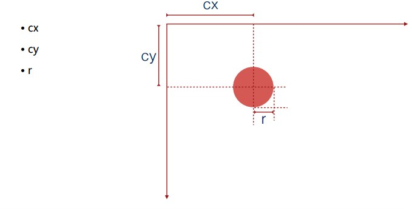
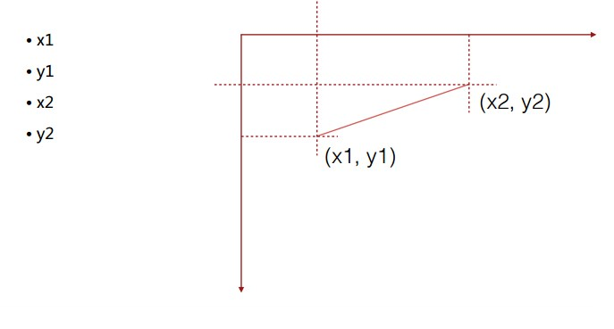

# 走进SVG

## 1. SVG简介

- 使用 XML 描述的矢量文件

- W3C 标准（1.1）（http://www.w3.org/TR/SVG11/）

- 浏览器支持情况（http://caniuse.com/#cats=SVG）

  ✓ IE 9+
  ✓ Chrome 33.0+
  ✓ Firefox 28.0+
  ✓ Safari 7.0+

### 1.1 SVG使用方式

- 浏览器直接打开
- 在HTML中使用``标签引用
- 在HTML中使用SVG标签
- 作为CSS背景

### 1.2 基本图形和属性

- 基本图形

`<rect>、<circle>、<ellipse>、<line>、<polyline>、<polygon>`

- 基本属性

 fill、stroke、stroke-width、transform

#### 1.2.1 `<rect>`

#### 1.2.2 `<circle>`

#### 1.2.3 `<ellipse>`

#### 1.2.4 `<line>`

#### 1.2.5 `<polyline>`

#### 1.2.6 `<polygon>`

#### 1.2.7 填充、描边、变换

- fill
- stroke
- stroke-width
- transform

### 1.3 基本操作API

创建图形

- document.createdElementNs(ns, tagName)

  ns: 指定与元素相关联的[命名空间URI](http://www.w3.org/TR/2004/REC-DOM-Level-3-Core-20040407/glossary.html#dt-namespaceURI)的字符串。

  (

  - HTML - 参阅 `http://www.w3.org/1999/xhtml`

  - SVG - 参阅 `http://www.w3.org/2000/svg`

  - XBL - 参阅 `http://www.mozilla.org/xbl`

  - XUL - 参阅 `http://www.mozilla.org/keymaster/gatekeeper/there.is.only.xul`

    )

添加图形

- element.appendChild(childElement)

设置/获取属性

- element.setAttribute(name, value)
- element.getAttribute(name)

