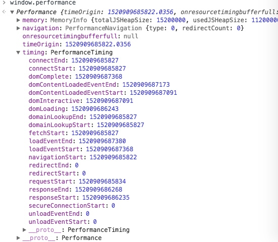

# 性能优化

最近面试过程中，几乎所有公司都会提及性能优化问题。可以看出随着前端工程化开发，vue等框架渐渐成熟后，更多公司开始关注性能方面优化来提供产品的用户体验。

**那么从用户角度来说，哪些能提高用户体验呢？**

答： 一者是**页面加载**的加快，是页面**使用起来很流畅**。

下面就从这两点，结合网络上优秀的文章，整理如下资料以供学习和实践：


### 1. 页面加载

#### **1.1 加载时间**

从浏览器打开到页面渲染完成，经历了什么？都花费了多少时间？

答：

- 先分析一个页面从请求到渲染完做了什么？

  浏览器解析->查询缓存->dns查询->建立链接->服务器处理请求->服务器发送响应->客户端收到页面->解析HTML->构建渲染树->开始显示内容(白屏时间)->首屏内容加载完成(首屏时间)->用户可交互(DOMContentLoaded)->加载完成(load)

  ​

- 前端怎么监控页面请求过程的时间？

  首先推荐一个[PerformanceTiming](https://link.juejin.im/?target=https%3A%2F%2Fdeveloper.mozilla.org%2Fzh-CN%2Fdocs%2FWeb%2FAPI%2FPerformanceTiming)，是一个HTML5的方法，可以获取到很多页面加载相关的数据，如果不使用该API，可以以服务器渲染返回的时间。先来看看在 Chrome 浏览器控制台中执行 window.performance 会出现什么：

  

  ​

  一张图简单解释下 performance 中的属性：

  

  一般常用的数据如下：

  ```
  DNS解析时间： domainLookupEnd - domainLookupStart
  TCP建立连接时间： connectEnd - connectStart
  白屏时间： responseStart - navigationStart
  dom渲染完成时间： domContentLoadedEventEnd - navigationStart
  页面onload时间： loadEventEnd - navigationStart
  ```

  详情请查看：[初探 performance – 监控网页与程序性能](http://www.alloyteam.com/2015/09/explore-performance/)


#### **1.2 如何优化**

答：页面请求过程中每一部分的时间都知道了，就可以**针对性**的优化。结合Yahoo前端性能团队总结的35条黄金定律：

> Yahoo 的Excetional Performance 团队总结出了一系列可以提高网站速度的方法。可以分为 7大类 35条（包括内容、服务器、CSS、JavaScript、Cookie、图片、移动应用）。


- **页面内容**
  - **减少 HTTP 请求数**
  - **减少 DNS 查询**
  - **避免重定向**
  - **缓存 Ajax 请求**
  - **延迟加载**
  - **预先加载**
  - **减少 DOM 元素数量**
  - **划分内容到不同域名**
  - **尽量减少 iframe 使用**
  - **避免 404 错误**
- **服务器**
  - **使用 CDN**
  - **添加 Expires 或 Cache-Control 响应头**
  - **启用 Gzip**
  - **配置 Etag**
  - **尽早输出缓冲**
  - **Ajax 请求使用 GET 方法**
  - **避免图片 src 为空**
- **Cookie**
  - **减少 Cookie 大小**
  - **静态资源使用无 Cookie 域名**
- **CSS**
  - **把样式表放在 `<head> `中**
  - **不要使用 CSS 表达式**
  - **使用` <link>` 替代 @import**
  - **不要使用 filter**
- **JavaScript**
  - **把脚本放在页面底部**
  - **使用外部 JavaScript 和 CSS**
  - **压缩 JavaScript 和 CSS**
  - **移除重复脚本**
  - **减少 DOM 操作**
  - **使用高效的事件处理**
- **图片**
  - **优化图片**
  - **优化 CSS Sprite**
  - **不要在 HTML 中缩放图片**
  - **使用体积小、可缓存的 favicon.ico**
- **移动端**
  - **保持单个文件小于 25 KB**
  - **打包内容为分段（multipart）文档**


##### 1.2.1 页面方面

**1. 减少 HTTP 请求数：**

从发起请求到页面渲染，绝大部分时间花费在网络请求响应上，那么缩短网络请求响应时间，就变成首要解决的问题。减少HTTP请求会很有效的缩短时间，因为**浏览器对每个域名并行请求数量**是有限制的。

- 合并js，css
- 精灵图
- 图片转base64
- HTTP2的多路复用，大幅度降低多文件请求的开销，具体可以自行百度HTTP2(暂时覆盖率不高)


**2. 减少 DNS 查询**

从输入URL访问通过DNS解析至对应IP地址，需要一定的时间，且这段时间是**等待**状态不会处理任何事。那么减少DNS数量和DNS查询时间也可以减少请求时间。

```html
<!-- DNS预获取 -->
<link rel="dns-prefetch" href="https://www.zhix.net">
<link rel="dns-prefetch" href="https://api.share.zhix.net">
```


**3. 避免重定向**

尽可能避免使用重定向，除非迫不得已重定向至404页面。

最浪费的重定向经常发生，而且很容易被忽略：URL 末尾应该添加 `/` 但未添加。比如，访问 `http://astrology.yahoo.com/astrology` 将被 301 重定向到 `http://astrology.yahoo.com/astrology/`


**4. 缓存异步请求**

Ajax异步请求虽然不刷新页面，但是改变不了异步的本性，所以在特定的情况下，可以缓存住某些非经常变动的数据。可以通过设置合适的 [`Cache-Control`](https://developer.mozilla.org/en-US/docs/Web/HTTP/Headers/Cache-Control) 响应头，让浏览器有条件地发起请求。

鉴于静态内容和动态内容不同的缓存策略，实践中一般会把二者部署在不同的服务器（域名）以方便管理。


**5. 延迟加载**

非首屏使用的数据、样式、脚本、图片等，以及用户交互时才会显示的内容都可以通过懒加载方式加载，减少首屏时间。

- `script`标签的defer属性，async属性(不能保证按顺序)
- 图片懒加载
- 监听load事件后，动态加载需要的文件；setTimeout放在队列最后加载。


**6. 预先加载**

- 无条件预先加载：页面加载完成（`load`）后，在空闲时间内，加载用户可能使用到的文件。
- 有「阴谋」的预先加载：页面即将上线新版前预先加载新版内容。网站改版后由于缓存、使用习惯等原因，会有旧版的网站更快更流畅的反馈。为缓解这一问题，在新版上线之前，旧版可以利用空闲提前加载一些新版的资源缓存到客户端，以便新版正式上线后更快的载入。(「双十一」、「黑五」这类促销日来临之前，也可以预先下载一些相关资源到客户端（浏览器、App 等），有效利用浏览器缓存和本地存储，降低活动当日请求压力，提高用户体验。)


**7. 减少 DOM 元素数量**

浏览器控制台中输入以下代码可以计算出页面中有多少 DOM 元素，可以尝试用伪元素替代某些DOM元素。

```js
document.getElementsByTagName('*').length;
```


**8. 划分内容到不同域名**

浏览器一般会限制每个域的并行线程（一般为 6 个，甚至更少），使用不同的域名可以最大化下载线程，但注意保持在 2-4 个域名内，以避免 DNS 查询损耗。


**9. 尽量减少 iframe 使用**

厌恶这个东西，不解释


**10. 避免 404 错误**

返回无效的请求不管体验、性能方面都不好。再者就算有404页面提示提高用户体验，但依旧浪费性能。


##### 1.2.2 服务器

**1. 使用 CDN**

静态文件发布在CDN加速服务器上，可根据用户位置选择距离最近的服务器获取，提高请求过程的速度。CDN可能也会存在缓存的问题，需要注意这点。


**2. 添加 Expires 或 Cache-Control 响应头**

控制缓存也是能很显著提高用户体验的手段，不管是静态文件还是动态文件都需要设置最优的缓存控制属性。

- **静态内容**：将 `Expires` 响应头设置为将来很远的时间，实现「永不过期」策略；
- **动态内容**：设置合适的 `Cache-Control` 响应头，让浏览器有条件地发起请求。

鉴于静态内容和动态内容不同的缓存策略，实践中一般会把二者部署在不同的服务器（域名）以方便管理。


**3. 启用 Gzip**

Gzip 压缩通常可以减少 70% 的响应大小，主流 Web 服务器都有相应模块，而且绝大多数浏览器支持 gzip 解码。所以，应该对 HTML、CSS、JS、XML、JSON 等文本类型的内容启用压缩。

**注意**，图片和 PDF 文件不要使用 gzip。它们本身已经压缩过，再使用 gzip 压缩不仅浪费 CPU 资源，而且还可能增加文件体积。


**4. 配置 Etag**

Etag 通过文件版本标识，方便服务器判断请求的内容是否有更新，如果没有就响应 `304`，避免重新下载。


**5. 尽早输出缓冲**

略.


**6. Ajax 请求使用 GET 方法**

略.


**7. 避免图片 src 为空**

html和js中`img`标签或者DOM元素避免src属性为空，虽然没有加载图片，但是依旧会发起一次http请求(chrome 会向当前页面发送请求)。


##### 1.2.3 cookie

**1. 减少 Cookie 大小**

Cookie每次请求都会在浏览器和服务器之间传递，所以减少Cookie或者设置有效期能有效降低请求处理的时间，减少带消耗等。


**2. 静态资源使用无 Cookie 域名**

静态资源放在无Cookie的服务器中，无Cookie传输提高性能。


##### 1.2.4 CSS

**1. 把样式表放在 `<head>` 中**

把样式表放在 `<head>` 中可以让页面渐进渲染，尽早呈现视觉反馈，给用户加载速度很快的感觉。

如果把样式表放在页面底部，一些浏览器为减少重绘，会在 CSS 加载完成以后才渲染页面，用户只能对着白屏干瞪眼，用户体验极差。


**2. 不要使用 CSS 表达式**

这里只IE老版本里特殊方式，已废弃。


**3. 使用 `<link>` 替代 `@import`**

对于 IE 某些版本，`@import` 的行为和 `<link>` 放在页面底部一样。所以，不要用它。


**4. 不要使用 filter**

略.


##### 1.2.5 JavaScript

**1. 把脚本放在页面底部**

浏览器下载脚本时，会阻塞其他资源并行下载，即使是来自不同域名的资源。因此，最好将脚本放在底部，以提高页面加载速度。也可以考虑使用defer和async属性


**2. 使用外部 JavaScript 和 CSS**

外部 JavaScript 和 CSS 文件可以被浏览器缓存，在不同页面间重用，也能降低页面大小。但是如果复用较少，则不如将css嵌入在页面中，减少HTTP请求。


**3. 压缩 JavaScript 和 CSS**

不解释。


**4. 移除重复脚本**

略.


**5. 减少 DOM 操作**

javascript和DOM节点交互相当耗性能，尽可能一次性操作DOM，不要多次操作DOM。

- 缓存已访问过的DOM
- DOM树拼接好后一次性插入
- 用className来代替操作style读取修改


**6. 使用高效的事件处理**

可以提前处理事件，在DOMContentLoaded后用户就可以交互了，不必要等到load事件后。

对于 `resize`、`scroll` 等触发频率极高的事件，应该通过 debounce 等节流机制降低处理程序执行频率。


##### 1.2.6 图片

**1. 优化图片**

略.


**2. 优化 CSS Sprite**

减少sprite图的大小为目的即可。


**3. 不要在 HTML 中缩放图片**

略.


**4. 使用体积小、可缓存的 favicon.ico**

我觉得这里要注意的就是保证favicon.ico的存在。


### 2. 使用起来流畅

- 尽可能轻量级。


- scroll等触发频率高的事件做节流处理。
- 用css3动画代替js定时器动画。
- 资源预加载，少去用户等待时间。
- ...


参考文章：

> [当面试官问你如何进行性能优化时，你该这么回答(一)](https://juejin.im/post/5a99f80cf265da238c3a1e16)
>
> [前端性能优化最佳实践](https://csspod.com/frontend-performance-best-practices/)
>
> [初探 performance – 监控网页与程序性能](http://www.alloyteam.com/2015/09/explore-performance/)

